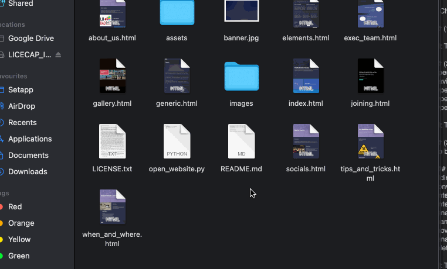

# Guide for updating the website (intended for future BadSoc Executive personnel)

## Saving your changes. 
* After making your changes / each change, you will need to update the online codebase with your changes. 
* This is done by 'commiting' and 'pushing' your changes to the online website codebase. 
* How to save your changes:
  * []

### (1) Create the website folder

### (2) Get the website code into that folder
* open the terminal (MacOs/linux) || command prompt (windows)
* navigate to the newly created folder 'cd Documents <enter> cd website <enter>'
* type: 'git init' (without the '')
* type: ' git remote add origin https://github.com/badsoc/badsoc.github.io'
* type: 'git pull origin main'

### (3) Updating the website
* go back to the file explorer. There should now be all of the website files within that folder

#### ---Updating the exec pictures---
(adding the new pictures)
* convert your pictures to .jpg if necessary (get them ready in a folder of your choosing)
* enter the images folder
* enter the execs_images folder
* rename all of the exec pictures (add '1' at the end- this makes it so we can rename the new pictures later. e.g. rename 'president' to 'president1')
* move your pictures into the folder
* rename your pictures to match the existing exec pictures. (e.g. rename the new president picture to 'president' )
*delete all of the old exec pictures (i.e. with '1' at the end)

#### --- Opening a file--
* In the file explorer, navigate to the folder that holds all of the website files (the one you created earlier)
* right click on exec_team.html
* select 'open with' and then select a text editor of your choice (e.g. visual studio code) 

#### --- Updating the exec text---
* scroll down to the text being updated (should be under a section labelled '\<!-- [number] -->' ), underneath of the section '\<!-- Exec Information -->' 
* place the cursor at the text being updated
* remove the old text, and replace with the new text 
* save (command + s)

#### ---Removing execs---

* scroll down to the section containing the executive being removed
* select everything from (and including) '\<!-- [number] -->' until and including '\</section>'
* delete (e.g. by pressing the backspace)
* save (command + s)

#### ---Adding execs---

* scroll down to the section named '\<!-- Exec Information -->' (around line 55)
* copy everything from (and including) '\<!-- One -->' until and including '\</section>'
* paste this after the last section (e.g. after \<!-- Three -->' )
* save (command + s)

###  ---Changing the session times---

* right click 'when_and_where.html'
* select 'open with' and select a text editor of your choosing (e.g. visual studio code)
* scroll down to the session time text
* change to the new text
* save (command + s)

### ---Updating the background banner---
* In the file explorer, navigate to images
* replace the picture 'banner.jpg'

### ---Updating gallery pictures---
* In the file explorer, navigate to images / gallery_images / court_pics
* replace the pictures here, being sure to give the exact same name to the image being replaced (e.g. 01.jpg -> 01.jpg)

### (4) updating Github to hold the new website
* go back to the terminal (which should still be opened to the newly created 'website' folder)
* type 'git add -A'
* type 'git commit -m "updated execs" ' 
* type 'git push -u origin main'

## Still stuck / want to do more?
* We recommend contacting the computer science department, and asking for assistance. 